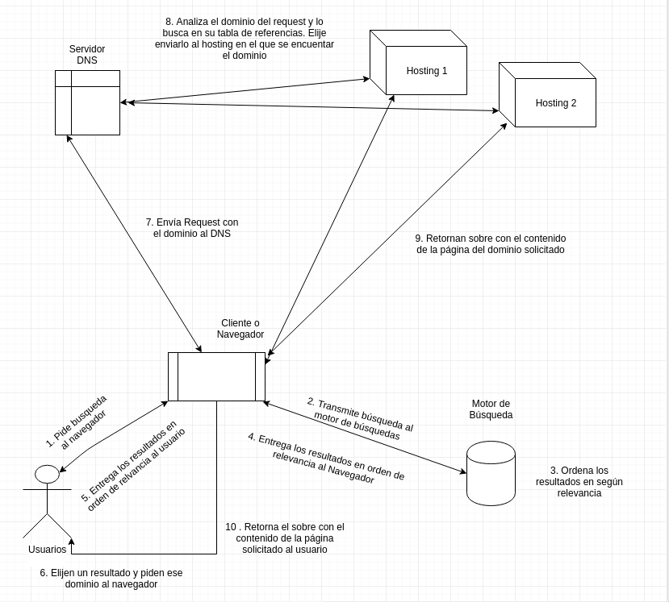

# 1.3 Cómo funciona Internet

**Módulo 1 - Fundamentos**

## Objetivos

- Se aprenderán los principales elementos que componen el internet
- Se aprenderá como funcionan los principales elementos que conforman internet

## Descripción corta

Los alumnos aprenderán como se estructura internet, los distintos componentes implicados y el por qué de esta estructura.
Se harpan ejercicios que les permitan entender las principales partes que componen Internet, y como estas funcionan.
Con esto entenderán donde entra el trabajo de un maquetador web, y los conceptos básicos que deben conocer.

### Presentación

- [Link a las diapositivas](https://drive.google.com/open?id=1_NCxKUn1V4BsuUQnqivTNdzbKDB1YA2i_ZsYrh2uOU0)

## Conceptos

- Cliente/Servidor
- Dirección IP (4 billones)
- paquetes TCP/IP
- ISP
- Dominio
- DNS
- Hosting
- Router
- Browser (Navegador)
- Search Engine
- Request/Response

## Actividades

### I. Pedido de imagen por internet

Se simula un **Request** de una imagen a un servidor.

Una persona será el servidor. 4 Personas serán los que llevan los paquetes. Una última será el cliente.

0. El cliente y el Servidor se colocan una etiqueta con sus IP
1. Se envía un sobre con un mensaje que dice "Dame una foto de gato" al servidor con la IP del servidor como destinatario y la del cliente como emisor
1. El Servidor muestra como no cabe la foto en un solo sobre, la parte en 4 y las coloca en cada sobre. Cada sobre
   deberá decír su número y total ej. _1/4_, _3/4_. Debe tener además como destinatario al cliente y como emisor al servidor.
1. Cada mensajero lleva un sobre al Cliente
1. El cliente ordena los sobres y reconstruye la foto

#### Material de la Actividad

- Etiquetas para nombre
- 5 sobres pequeños (tamaño tarjeta de regalo)
- Foto de gato impresa en A4
- Lapicero

### II. Representación del internet con personas

En este ejercicio se representará en mayor profundidad el flujo de uso de un típico usuario de internet, buscando explicar el
funcionamiento de la tecnología que existe detras.

##### Diagrama

##### 1. Usuario (1 a más personas)

Pueden ser varias personas, los usuarios construyen búsquedas de google usando los keywords del listado que se les entrega.

1.  Deben entregar una ficha con la búsqueda al **Cliente (2.1)**

2.  Recibe el listado de páginas del **motor de búsqueda** de parte del **Cliente** y elige un resultado **pasar a (1.3)**.

3.  El **Usuario** entrega la página que desea recibir al **Cliente (2.3)**.

4.  Al recibir el sobre con la página web de el **Cliente** el usuario lo abre completando así el ciclo.

##### 2. Cliente Navegador (Browser) (1 persona)

Su función es recibir el pedido de búsqueda de los **usuarios** y entregarlo al equipo
que es el **motor de búsqueda**

1. Recibe el pedido de búsqueda y lo entrega al **motor de búsqueda (3.1)**.

2. Una vez que el **Cliente** reciba el listado de resultados de **El motro de Búsqueda** debe presentarlo al **usuario (1.2)** que hizo el pedido para que este elija que página desea ver.

3. Entrega la tarjeta con el Request de la página elegida al **Servidor DNS (4.1)**.

4. Al recibir la web del **Servidor Hosting** el **Cliente** entrega el sobre al **Usuario**.

##### 3. El Motor de Búsqueda (2-4 personas)

Es un equipo de personas que tiene una caja con las fichas que contienen las páginas web que han indexado.

1. Deben analizar la búsqueda que les envía el **Cliente** y devolver las páginas que consideren relevantes en orden de relevancia al **Cliente (2.2)**

##### 4. Servidor DNS (1 persona)

Es el encargado de encontrar en que hosting se encuentra alojada la web solicitada por el usuario y transmitir el pedido.

1. Al recibir un Request del **Cliente** debe buscar el dominio que le solicitan en su **tabla de servidores**. Al encontrarlo, debe agregar esa **dirección IP**
   al pedido y entregarla al **Servidor de Hosting (5.1)** adecuado.

##### 5. Servidor de Hosting (1 persona por servidor)

Cada persona representa un Hosting compartido y tiene 8 sobres con 8 páginas web. Los sobres tienen por fuera el **dominio** de la página web y por dentro
el archivo con información de mentira de **Response** de una web.

1. El Hosting recibe una petición de URL del **Servidor DNS** y busca el sobre para esa web. Al encontrarlo lo retorna
   directamente al **Cliente (2.4)** agregando la IP del cliente al sobre.

#### Material de la Actividad

1. [Listado de palabras clave para los usuarios](https://docs.google.com/document/d/1xhIOjEjODaOSy8wbA3RLxOH1ARm7fJeiXFDe397qNMk/edit?usp=sharing)
1. Tarjetas o fichas con los datos de las webs como salen en la búsqueda de Google por un lado y los datos para realizar el request por el otro
1. [Listado de webs con IP para el servidor DNS](https://docs.google.com/document/d/1Y1mVjw0JzCHIOK5QoC7MoemC2Td8QhVsHVlhUpkeYb8/edit?usp=sharing)
1. [Listado de webs/IP's y meta descriptions para crear las tarjetas](https://docs.google.com/spreadsheets/d/1HGAipLs-1gfowMCLJTw2m3R_G4aTsO9WWhv8anxWzHQ/edit?usp=sharing)
1. [Listado de Keywords con los que se pueden construir búsquedas de google](https://docs.google.com/spreadsheets/d/1HGAipLs-1gfowMCLJTw2m3R_G4aTsO9WWhv8anxWzHQ/edit?usp=sharing)
1. Sobres con la IP de cada una de las webs que tiene cada servidor con [un archivo con información de mentira](https://docs.google.com/document/d/14qrmNviaCWQc1MmzxSaMB4Y9ijWE-c8BC2xh72bgn20/edit?usp=sharing) dentro
