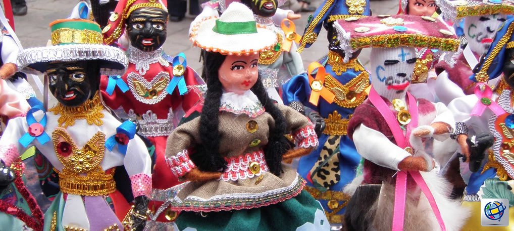
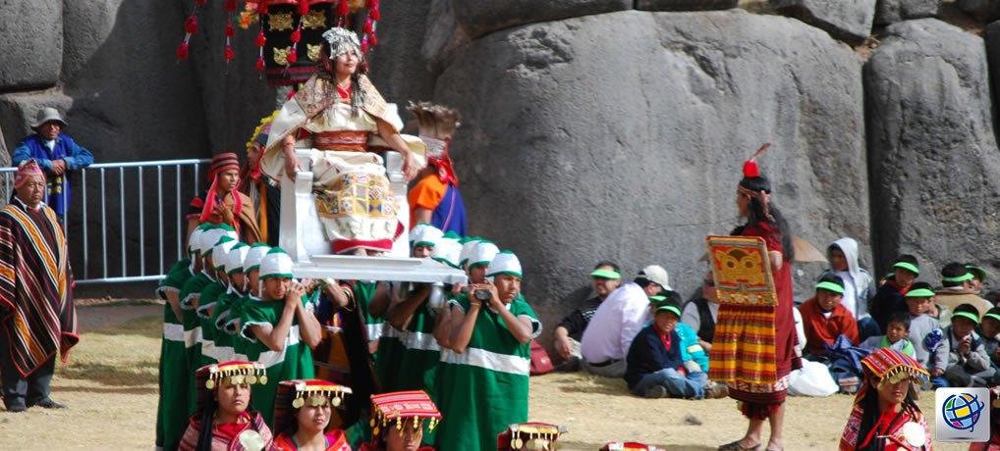
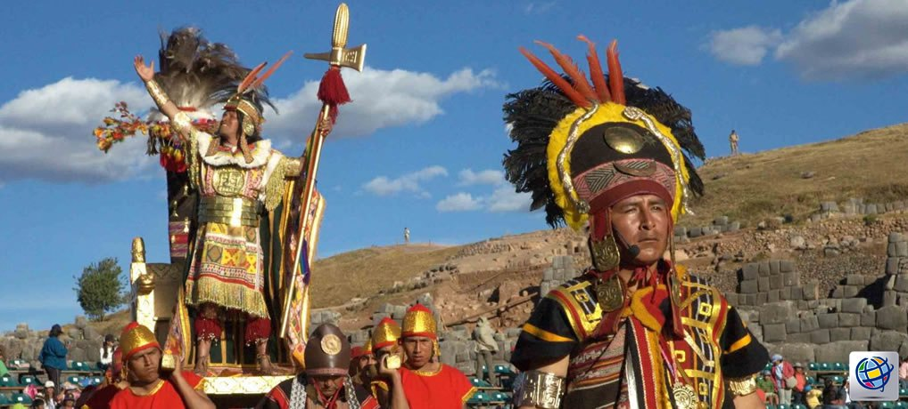
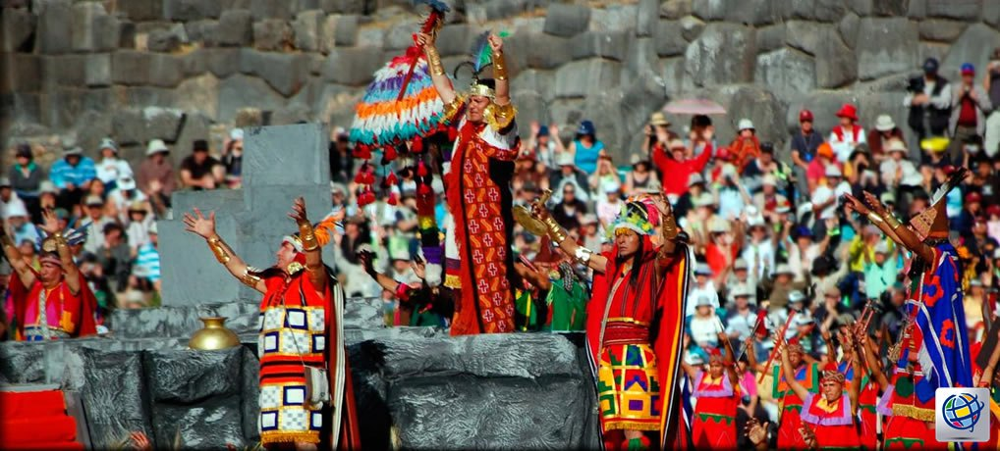
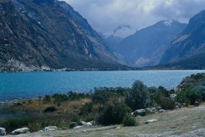
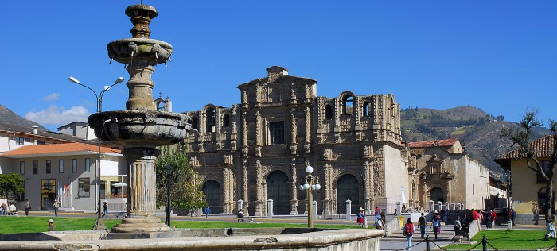
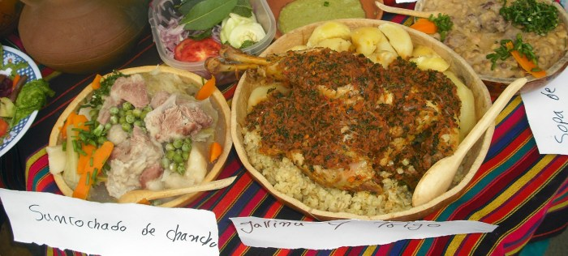

# Viajando por Perú

## Contenido

### El Santurantikuy, Feria del Arte Popular Cusqueño

Cada 24 de diciembre, en la Plaza Mayor se realiza la feria más grande de arte popular y costumbrista del Perú: La feria del Santurantikuy, donde centenares de artesanos provenientes de distintos lugares del Cusco y de otras regiones del país, exponen hermosos y originales trabajos fruto de su espíritu creador a lo largo del año y los cuales adornarán los nacimientos de hogares e instituciones. El Niño Manuelito es el personaje central de la fiesta de la navidad en Cusco.

#### SANTURANTIKUY

Poco después de instaurada la colonia española en Perú, en la ciudad de Cusco, tras la derrota -o decaimiento- de la sociedad incaica y ya “asimilada” la religión católica, se comenzó a celebrar cada 24 de diciembre, en la Plaza Mayor de cada pueblo o comunidad, la fiesta del Santurantikuy; feria de arte popular, en que la palabra quechua lo dice todo: Santu (santos)y Ticuy (venta).

Muchas de las crónicas de la colonia, que fueron escritas alrededor del siglo XVII, relatan que los sacerdotes españoles, recorrían los caseríos tratando de catequizar a los indios nativos. Justamente en épocas de Navidad, les hablaban de Enmanuel, el niño que nació en Belén y cuyo nombre quiere decir “Dios con nosotros”.

A pesar de la imposición de la religión católica los andinos no olvidaron sus tradiciones religiosas, manteniéndolas casi en forma escondida. La naturaleza, para ellos, tenía sus propias representaciones espirituales: el Apu, espíritu del cerro; la Pachamama, la tierra y el Inti, el Sol como divino hacedor.

En el Cusco, una ciudad con gran tradición indígena, la imagen del Niño Manuel, es venerada todos los años durante las Fiestas Navideñas, mediante una festividad que se denomina “Santurantikuy”. Esta celebración se prepara hasta con seis meses de anticipación -según los artesanos que nos comentan-. Llegado el momento, todo se escenifica en la Plaza de Armas, donde artesanos de todas las ciudades aledañas, llegan con sus creaciones, que dan vistosidad a una feria que visitan miles de personas. La imagen del niño Manuelito, ha sido creada por lo artesanos con diferentes actitudes. Algunos tienen el rostro con chapas rojas y una mirada pícara. Su cuerpo, parece tener piel de indio y mantiene sus brazos abiertos en señal de recibimiento. Otros lo han esculpido, cansado y casi dormido; a veces pensativo y risueño. También los hay gateando con la cabeza tratando de erguirse.

Antaño, el Santurantikuy connotaba la presencia de “altares” y terminaba a las tres o cuatro de la tarde. Ese mismo día, y desde tempranas horas de la mañana, comenzaban a llegar los artesanos, algunos desde comunidades lejanas, con sus mantas cargadas de niños Manuelitos -como le llaman al niño Jesús- pastores, reyes magos, vírgenes, angelitos y todo aquello que pueda incorporarse al nacimiento. Acuden a comprar algunas piezas para regalar y otras para incorporar, cada año una pieza, a sus nacimientos.

### Inti Raymi: “La Fiesta del Sol”

Fueron varias las razones que impulsaron a la civilización Inka a realizar los sacrificios y ofrendas al astro rey. Una fue que el Inka, al igual que la nobleza cusqueña, eran considerados hijos naturales del Sol; a él obedecían su existencia, y debían corresponderle con sacrificios y ofrendas.

El sol se iba alejando (junio – solsticio de invierno), el frio aumentaba, en los amaneceres el agua estaba escarchada, por tanto, había que pedirle al Sol que volviera, que al rayar los crepúsculos matutinos no siguieran avanzando hacia el norte. Finalmente, había que testimoniarle al dios Inti, la eternidad y total entrega de sus hijos, con sumisión y respeto.

El Inti Raymi es una fiesta que celebra al dios Sol de los incas. En la actualidad se recrea el 24 de junio de cada año como la festividad más solemne y grandiosa del desaparecido Imperio incaico. El escenario del Inti Raymi es la fortaleza de Sacsayhuamán, ubicada en la zona norte de la ciudad del Cusco, a 255 metros de altura sobre el nivel de su plaza de armas, o sea a 3 671 metros sobre el nivel del mar Según el Inca Gracilazo de la Vega, Sacsayhuamán es “la obra mayor y más soberbia que los incas mandaron construir para mostrar su poder y majestad”.

El pueblo del Cusco se prepara para la fiesta desde muchos días antes del 24 de junio, fecha en la que colma la explanada frente a la cual se levanta la fortaleza de Sacsayhuamán.

Al compás de milenarios aires musicales, delegados de los cuatro suyos desfilan con sus vestimentas típicas, y también, como venidas de otros tiempos, ñustas, coyas y pallas, las cuales avanzan en ondulantes columnas. Finalmente, de pronto, el Inca se deja ver. El soberano es transportado sobre una litera -que en la época legendaria era de oro y plata- y acompañado de un séquito de orejones y otros dignatarios que caminan a respetable distancia de él.

La fiesta en honor al dios Sol, se realiza en presencia del Inca, el Willaq Uma o Sumo Sacerdote, Tarpuntay, Wirapirikuq y Kallparikuy, al igual que los nobles y representantes de las panacas, para lo cual se utilizan tres impresionantes escenarios históricos y naturales:

#### Inti Raymi – Coricancha
Qorikancha (Cerco de oro): Templo principal del Cusco dedicado al Sol, donde se dice estaba el jardín de oro (aquí se realizaban los primeros rituales del culto al Apu Inti y a la Pacha Mama, donde fueron enterradas cuantiosas ofrendas, cuyas evidencias halladas en 1972 se encuentran en el Museo Garcilaso del INC).

#### Inti Raymi – Plaza de armas
La Plaza Mayor (el antiguo Auqaypata o Plaza del Guerrero): En tiempo de los Incas, en esta inmensa plaza se desarrollaba íntegramente la ceremonia en medio del gran USHNU (plataforma ceremonial).

#### Inti Raymi – Saqsaywaman
Saqsaywaman (voz que deriva de los términos quechuas “saqsay” y “waman”, que traducido al español significa “sacíate halcón”). Se encuentra a 3,555 m.s.n.m., a un kilómetro del barrio inca de Qollqanpata. Fue la Real Casa del Sol y templo consagrado al Rayo, según Garcilaso. Aquí desde 1944 tiene lugar la parte central del Inti Raymi contemporáneo ante una impresionante multitud.

Con casi sesenta años de existencia, el nuevo Inti Raymi es ahora parte inseparable de la vida del Cusco. No sólo es el acto central del mes en la ciudad, sino que su fama ha trascendido las fronteras peruanas y también, dentro de ellas, ha sido el ejemplo para otros festivales de la identidad nacional.

### ¡Descubre las 3 lagunas más impresionantes del Perú!

¿Quieres explorar la naturaleza del Perú? Si eres amante de los paisajes debes recorrer las lagunas más llamativas del país. Quedarás encantado inmediatamente y querrás quedarte a admirarlas por siempre. A continuación, descubre 3 de las lagunas más hermosas del Perú. ¡Anímate a visitarlas junto a tu pareja, amigos o familiares en tus próximas vacaciones!

#### Laguna de Llanganuco
* Locación: Callejón de Hualyas, Departamento de Ancash.
* Altitud: 3800 m.s.n.m.
* Clima: 10°C en promedio

Esta laguna es una de las más importantes en el país. A solo 2 horas de Huaraz puedes encontrar este hermoso destino turístico que te dejará maravillado. Su agua color azul verdoso lo convierte en el escenario perfecto para innumerables fotografías. Alrededor de la laguna, también se observa un paisaje imponente lleno de vegetación, montañas y nevados.

Debido a que es parte de una reserva natural, para poder entrar se necesita realizar un pago de 10 soles aproximadamente. Dentro de las tarifas, también se encuentra la opción de quedarte 3 días para acampar o 21 días si quieres pasar más tiempo. Justo muy cerca de esta laguna, se ha habilitado un área para camping.

#### Laguna Sauce o Laguna Azul

* Locación: Provincia de San Martín
* Altitud: 900 m.s.n.m.
* Clima: 28°C en promedio

Esta laguna se encuentra a menos de una hora de la ciudad de Tarapoto y es una de las más imponentes de la región selva de nuestro país.

Es conocida como Laguna Azul debido a que la laguna refleja el color azul del cielo despejado. Además de contemplar la belleza de la laguna, los visitantes pueden realizar diferentes actividades como moto acuática, paseos en canoas o botes a motor. La pesca deportiva es una de las actividades más populares entre los turistas.

Para poder llegar al lago, hay que atravesar el río Huallaga, lo cual se debe realizar en balsa. En pocas regiones del Perú se puede navegar en balsa, por lo que esta experiencia es completamente única.

#### Lago Titicaca
* Locación: Departamento de Puno
* Altitud: 3810 m.s.n.m.
* Clima: 8°C en promedio

Esta no es una laguna, pero es reconocida por lo turistas por lo emblemático que es para el Perú.

El lago tiene un área de 8500 km2, lo cual lo convierte en el lago más grande que tiene el Perú. Prueba de ello es que a lo largo y ancho del lago hay más de 15 islas habitadas y no habitadas, las cuales conforman un paisaje único.

Este lugar, sin duda alguna, tiene un gran valor histórico. El Lago Titicaca fue el lugar donde emergieron Manco Capac y Mama Ocllo con el objetivo de fundar el Imperio del Tahuantinsuyo. Asimismo, este lugar, antes de la época inca, fue habitado por la cultura Chiripa y Tiahuanaco, por lo que hasta ahora se pueden encontrar diversos restos arqueológicos.
 

No dejes de visitar ninguno de los innumerables destinos turísticos que tiene el Perú. ¡Estos tres escenarios naturales esperan por ti!

### 5 espectaculares motivos para conocer Cajamarca

También conocida como la capital del folclore peruano, la ciudad de Cajamarca es una de las más bellas y ricas, históricamente hablando, de nuestro país. Si estás pensando viajar a la sierra del Perú, te dejamos 5 buenas razones por las cuales Cajamarca debe ser tu próximo destino.

¿Aún no has decidido qué destino del interior del Perú conocer durante tus vacaciones? Te dejamos 5 espectaculares motivos por los cuales debes escoger Cajamarca.

#### Su historia
Cajamarca es una ciudad con mucha historia y valor cultural. Durante la época de la conquista, fue escenario de la captura del Inca Atahualpa y su posterior ejecución, tras lo cual se convirtió en una villa colonizada por españoles. Por ello, es posible encontrar en Cajamarca bellas construcciones que datan de la época colonial, como la catedral de Santa Catalina y el Conjunto Monumental de Belén. El último vestigio del imperio incaico que aún se mantiene en pie en Cajamarca es el famoso Cuarto del Rescate.

#### Sus aguas termales
A 6 kilómetros de la ciudad de Cajamarca se encuentran los famosos Baños del Inca. Ahí yace un balneario de aguas termales considerado como uno de los más importantes del continente, debido a las propiedades curativas de sus fuentes y a su tremendo valor histórico.

#### El carnaval de Cajamarca
Se trata de uno de los carnavales más famosos del Perú. Destaca por sus pintorescos desfiles y bailes, que llenan de música y alegría la ciudad. El carnaval de Cajamarca se celebra todos los años, antes del Miércoles de Ceniza.

#### La gastronomía cajamarquina
En Cajamarca puedes degustar deliciosos platos típicos de la región, como el picante de cuy con papa, el chicharrón con mote y las famosas humitas.

#### Turismo vivencial
Puedes interactuar con las comunidades campesinas y conocer más sobre sus costumbres y tradiciones. Asimismo, puedes aprender muchos de ellos y su visión del mundo participando en sus actividades agrícolas y ganaderas.

