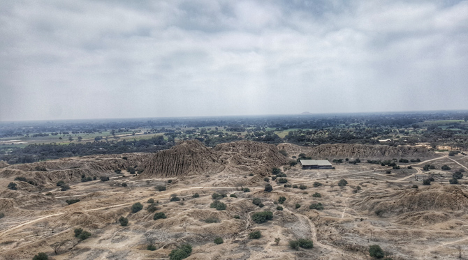
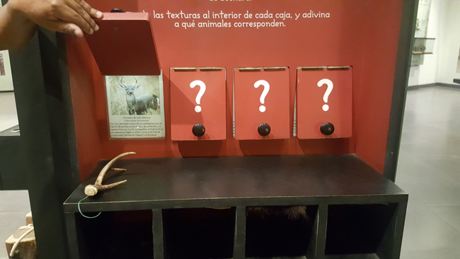
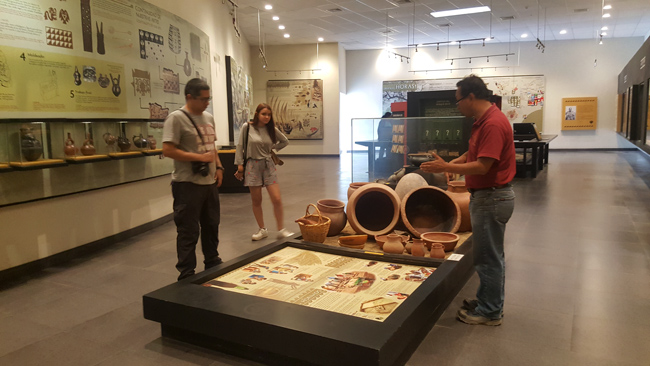
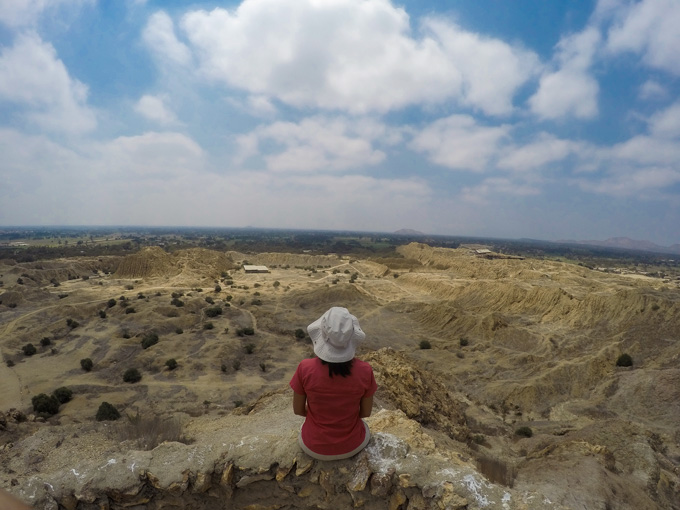
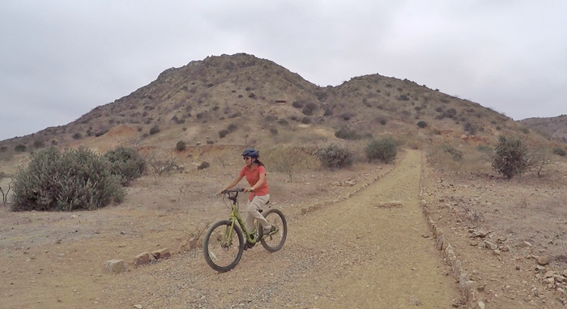
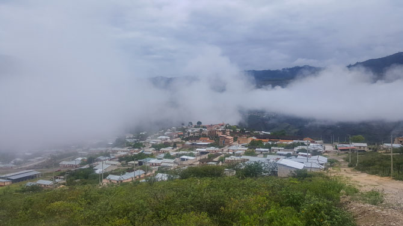
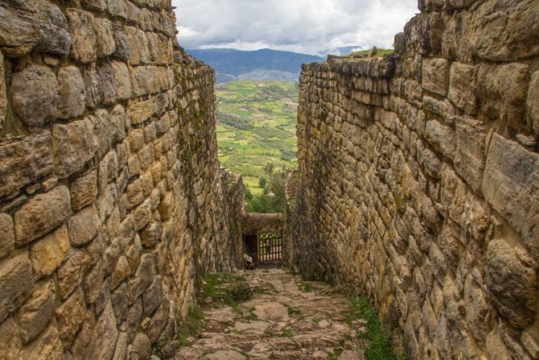

# Viajando por el Perú

## Secciones:

- Articulos
- Contacto
- Autor

## Contenido

### Chiclayo: rutas en bici en las Pirámides de Túcume y el Bosque de Pómac

Siempre relacioné Chiclayo con el Señor de Sipán, el museo Tumbas Reales, el arroz con pato y la playa Pimentel, aunque esta última no la conozco. Gracias a la invitación del tour operador Eco Serv, tuve la oportunidad de recorrer en bicicleta Túcume y el bosque de Pómac, además de otras experiencias que contaré en otros artículos.

Sabía que en Chiclayo habían pirámides, pero no tenía idea que existen 250 registradas en la región Lambayeque. Imagino que el paisaje durante la época Moche y Sicán o cultura Lambayeque debe haber sido impresionante. Felizmente, todavía hay lugares donde se investiga y se trabaja por su conservación y puesta en valor.
Aquí los detalles de las rutas en en bicicleta:

#### Bicitour en las Pirámides de Túcume

El complejo arqueológico de Túcume tiene 26 pirámides de la cultura Lambayeque, donde solo se ha excavado aproximadamente el 5%, según nos indicó el guía. Nos queda mucho por descubrir. A la fecha, se puede recorrer dos rutas:

Ruta A: museo y la Huaca Las Balsas (la única pirámide que se puede visitar actualmente de las 26)

Ruta B: museo y el mirador

Y por supuesto ruta A + B, que hicimos y recomiendo definitivamente.

Comenzamos por el museo de sitio. Me encantó porque además de aprender sobre el sitio arqueológico de Túcume, también nos enseña las tradiciones, festividades y cultura actual de la gente de Túcume. Aquí, no sólo hay objetos para observar como en todo museo, sino también para tocar y jugar, así como llamativas ilustraciones que cuentan la leyenda de Naylamp, fundador de la cultura Lambayeque.
Después del museo, viene la parte de acción. Sí, recorrer el complejo arqueológico en bicicleta, gracias al Bicitour, iniciativa financiada por Sustainable Preservation Initiative (SPI) y National Geographic. Un equipo de voluntarios maneja el programa, y toda persona que quiera usar las bicis, debe realizarlo en acompañamiento de ellos, quienes aseguran que nadie saldrá de los caminos establecidos así como su seguridad.

Primero fuimos hacia Huaca Las Balsas (ruta A). El camino es camino es corto, no es difícil, solo algunas partes de arena que obligan a pedalear con más fuerza.

La segunda parte en bici, de las Balsas al mirador, fue más difícil que la primera. El sol ya quemaba, el camino se volvió ondulante, con pequeñas subidas en terreno arenoso. Tuve que pedalear con fuerza, la arena no es como la pista limeña a la que estoy acostumbrada. Llegamos a la base del cerro La Raya, ubicado en el centro del complejo arqueológico y donde se encuentra el mirador.

Subimos por unas escaleras de cemento bien empinadas, donde cada escalón parece el doble de alto de una escalera normal. Desde arriba, la vista compensa el calor y esfuerzo. Se aprecian mejor las pirámides, que a diferencia de la forma clásica como las egipcias, que la mayoría tenemos en nuestra mente, no terminan en punta.

Subimos por unas escaleras de cemento bien empinadas, donde cada escalón parece el doble de alto de una escalera normal. Desde arriba, la vista compensa el calor y esfuerzo. Se aprecian mejor las pirámides, que a diferencia de la forma clásica como las egipcias, que la mayoría tenemos en nuestra mente, no terminan en punta.

#### Ruta de bicicleta en el Santuario Histórico Bosque de Pómac

Un bosque de algarrobos, la mayor concentración de estos árboles en todo el mundo, donde también se encuentran pirámides de la cultura Lambayeque. Felizmente es un área natural protegida, donde se protege la biodiversidad y su patrimonio cultural.

El bosque tiene más de 5 mil hectáreas, tal vez por eso, la forma más usual de visitarlo es en auto. Pero, esta vez la recorrimos en bici, que según mi parecer, es mucho mejor. Los caminos dentro del santuario son mucho más fáciles de recorrer que en Túcume, porque no es terreno arenoso.

Partimos del lodge Huaca de Piedra hacia al bosque, llegamos a la entrada luego de recorrer aproximadamente 2,6 kms. en 20 minutos. Luego seguimos la pista, por 6 kms más, hasta el mirador ubicado en el cerro Las Salinas. El clima estuvo perfecto, nublado y fresco. El camino plano y la bici muy cómoda. Pedaleaba mirando el paisaje e incluso pude ver una ardilla en los árboles.

Llegamos al cerro, y allí lo más divertido para mí, fue intentar subir en bici hacia el mirador. Hice cuatro intentos, solo llegué hasta finalizar la primera pendiente, pero valió la pena para bajar a velocidad. Esta parte si es tierra, no pista. Para mí, fue la más difícil de todos los recorridos en bici pero la más divertida.

### Aprendiendo a bailar como un Diablico de Túcume en mi viaje a Chiclayo

Uno, dos, tres y cuatro. Moviéndome de izquierda a derecha y viceversa, cruzando los pies y a la vez mover la cabeza. Al principio me confundí, pero creo que al final, pude hacer algunos pasos bien y bailaba como Diablico de Túcume principiante.

Nunca había escuchado de esta danza, fue toda una sorpresa. En mi mente, relacionaba a Chiclayo y Lambayeque con la marinera y el tondero. Pero, ¡claro que hay muchas más! En mi último viaje a Chiclayo, gracias a Eco Serv, tuve la oportunidad de conocer al señor Cesar García Llauce, uno de los Diablicos de Túcume más comprometidos con la difusión del folklore de su pueblo, y quién viene bailando alrededor de 23 años.

#### Y ¿quiénes son los Diablicos?

Surgieron en la colonia, para convertir a los indígenas en la religión católica. De acuerdo a la leyenda, los españoles bajaban en una carreta que venía desde el cerro El Purgatorio (ubicado en el complejo arqueológico de las Pirámides de Túcume), disfrazados de diablos o demonios, y recorrían las calles asustando a los indígenas para obligarlos a rendir culto a la virgen.

Actualmente los Diablicos bailan con mucha devoción para la Virgen Purísima de Concepción, todas los años, durante la primera semana de febrero. Cerca de mil danzantes bailan en procesión, dirigidos por dos diablos mayores, y vigilados por los regidores quienes golpean con una penca a aquellos que se porten mal.

#### “Diablico por un día”

El señor Cesar García ha desarrollado una linda experiencia, para que todo visitante en Túcume, pueda conocer la danza, sin tener que viajar específicamente en las fiestas de la Virgen. En su casa, ubicada en la plaza de armas de Túcume, recibe a los visitantes. Yo fui una de ellas.

Nos recibió con su traje de Diablico. Primero nos enseñó cómo se hacen las máscaras, los instrumentos musicales, la historia, la vestimenta y por supuesto bailó. Luego, a quién lo desee, le enseña los pasos básicos de la danza. No lo dudé por un minuto, me encanta bailar. Su esposa me vistió con la capa y parte del traje típico. Comencé a seguir los pasos, que no parecían complicados. Todo estuvo bien, hasta que tuve que ponerme la máscara. ¡Qué calor! y qué difícil mover la cabeza con ella. No sé como resisten bailar horas de horas, a pleno sol, y con ese peso. Tal vez no lo entiendo, porque no tengo esa devoción, que los mueve a bailar por la Virgen.

### Visitando Kuélap por mi cuenta: combi más caminata más telecabina

Kuélap es sin duda la estrella de Amazonas. Así que mientras estuve dos semanas en Duraznopampa, pueblo de la provincia de Chachapoyas, la visitamos con la siguiente ruta:

#### 1. En combi hacia Tingo

Desde Duraznopamapa madrugamos para salir en la única combi que parte 5:00 a.m. y llegamos a las 6:00 a.m. a Tingo.

Si parten de Chachapoyas, ir al terminal terrestre y tomar los colectivos que pasen por Tingo, o mejor directo hasta Nueva Tingo. Tienen bastante frecuencia y el costo está entre 7 y 10 soles. Les recomiendo salir lo más temprano posible (7:00 am). El trayecto dura 1 hora (pista asfaltada).

#### 2. Caminando de Tingo hacia Nueva Tingo

A las 6 a.m. hacía frío y no veiamos combis, así que decidimos subir caminando. Fueron aprox. 50 minutos a paso lento. Si no quieren caminar pueden esperar una mototaxi o un colectivo que son frecuentes. El pasaje cuesta 3 soles.

Como las telecabinas recién abren a las 8:00 a.m. y nosotros llegamos cerca de las 7 de la mañana, aprovechamos para tomar desayuno en Nueva Tingo.

#### 3. Telecabina a Kuélap

Las oficinas de las Telecabinas están a unas cuadras arriba de la plaza principal de Nueva Tingo. Allí se compran los tickets: S/. 20 por persona por viaje de ida y vuelta. (tarifa plana para todos). Desde aquí te llevan en minibus por 10 minutos aproximadamente hasta el lugar de embarque a la telecabina.

El trayecto en el teleférico tiene una vista increíble y me pareció bastante largo a pesar que dura 10 a 15 minutos. Se puede ver como va cambiando la vegetación en las montañas en la medida que gana altura, llega cerca de los 3000 m.s.n.m. Personalmente me gustó la vista pero soy muy nerviosa, me da miedo que llueva o que haya demasiado viento durante el trayecto.

#### Parador Turístico La Malca

Llegamos aquí cerca de las 10 am. Es el punto donde te deja las telecabinas. Hay un restaurante, venta de artesanías, baños, boletería de tickets para Kuélap (20 soles adulto y 10 soles adulto mayor) el centro de interpretación. Desde aquí se comienza la subida a pie o a caballo hacia el sitio arqueológico.

#### Centro de Interpretación: imprescindible

Definitivamente antes de subir al sitio arqueológico tienen que entrar al centro de interpretación y darse un tiempo para aprender que significó Kuélap para la cultura Chachapoyas.

#### Visita en Kuélap

Desde La Malca subimos caminando al complejo arqueológico. Fueron 30 minutos a ritmo lento y parando para tomar fotos por un recorrido de aproximadamente 900 metros. Si desean pueden subir a caballo, cuesta 15 soles.

La imponente muralla sur es lo primero que se ve de Kuélap. Lo primero que viene a la mente es que es una fortaleza, no solo por la altura del muro sino porque rodea todo el complejo. Sus famosas entradas angostas y el torreón norte que aparentemente es un punto de vigilancia parecen indicar que tenía esa función. Sin embargo, en el centro de interpretación explican que no fue fortaleza porque los muros fueron construidos para nivelar el terreno y no para defensa, y el torreón se encuentra en el espacio menos vulnerable.

Seguimos el camino que está bien señalizado, rodeando el lado este de la muralla buscando la emblemática entrada que sale en todas las fotos. Lamentablemente estaba cubierta por trabajos de restauración. Entramos por la puerta norte, donde te piden tu boleto para ingresar.

Una vez adentro de Kuélap seguimos el circuito que está muy bien señalizado. Te permite ir hasta el extremo norte, ver el torreón y luego pasar por la zona central y sur para salir por la puerta oeste; de esta forma de permite recorrer toda la ciudadela. En el camino vimos varias viviendas circulares con los motivos de rombos y triángulos, los más característicos de los Chachapoyas. Llegó a tener alrededor de 500 viviendas y construcciones que al parecer tenían una función ritual como “El tintero.” Por fuera parece una torre circular pero por dentro es como un cono invertido donde se han encontrado ofrendas.

### Contacto:

#### Nombre: Ana Palomares

#### mail: [info@blogviaje.com]()

### Autor:

#### Ana Palomares

Me encanta viajar, ya sea por relax, para aprender, disfrutar, conocer, etc. Pero la principal es porque me permite conocer otras realidades, entender mejor el mundo en que vivimos y cuestionarme algunos paradigmas o el status quo de nuestra sociedad.

Inicié el blog para compartir la información que recopilo durante mis viajes, las preguntas y cuestionamientos que vienen a mi mente durante mi viaje y por supuesto tips para ayudar a más viajeros a recorrer Perú. Luego también comencé a viajar por Latinoamérica y también escribo sobre esos viajes en el blog. Uno de los principales objetivos es contribuir a la promoción de un viaje responsable.

Espero que encuentren útil la información, compartan sus viajes y recomienden que hoteles, restaurantes o agencias de viaje, u otro servicio utilizaron y les brindaron un buen servicio, o por el contrario, tuvieron algún inconveniente. Todos los comentarios (en la medida que sean sinceros), ayudan a otras personas a planear su viaje.
